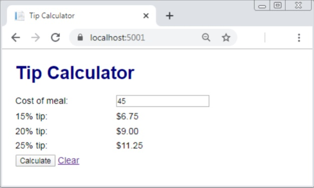

# Build the Tip Calculator app
For this project, you will build a one-page app like the one shown below.

### Specifications
- When the app starts, it should display an empty text box and tip amounts of 0.00.
- If the user enters a valid meal cost and clicks the Calculate button, the app should calculate and display the tip amounts as shown above.
- If the user enters invalid data and clicks the Calculate button, the app should display a summary of validation errors above the form and $0.00 for the tip amounts.
- The cost of the meal is required and must be a valid number that’s greater than 0.
- If the user clicks the Clear link, the app should reset the page to how it was when the app first started.
- Use the MVC pattern. To do that, create a model class that stores the cost of the meal and includes a helper method for calculating the tip percentages.
- Use a Razor layout to store the **`<html>`**, **`<head>`**, and **`<body>`** elements.
